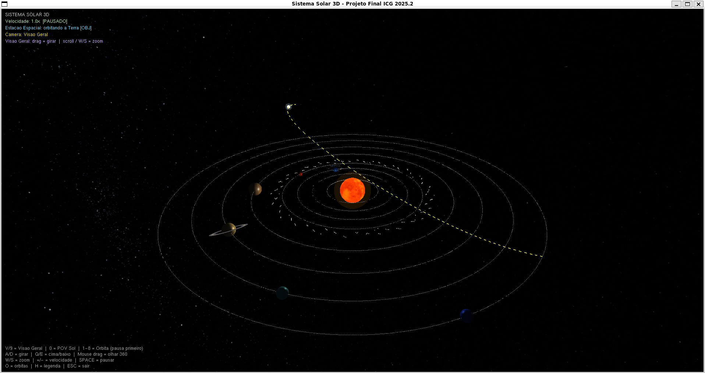

# Sistema Solar 3D em OpenGL

## Sobre o projeto

Esse projeto é uma simulação 3D do sistema solar desenvolvida em C utilizando OpenGL/GLUT, como aplicação prática dos conceitos estudados na disciplina de Introdução a Computação Gráfica com o professor Davi Santos, no período de 2025.2 - UFPB.

A proposta foi criar um ambiente interativo que permitisse explorar na prática temas como renderização 3D, transformações, iluminação, texturização e controle de câmera.

O sistema permite navegar pelo espaço, além de alternar entre diferentes modos de câmera, incluindo visualização geral, POV do Sol e foco em planetas específicos.

---

## Funcionalidades

* Órbitas e rotação planetária com velocidade ajustável
* Cometa com trajetória baseada em curva de Bézier cúbica (implementação manual)
* Estação espacial carregada a partir de arquivo `.obj`
* Lua e estação espacial orbitando a Terra
* Sistema de câmera com múltiplos modos (visão geral, Sol e órbitas)
* HUD com informações na tela

---

## Organização do código

O projeto foi dividido em múltiplos arquivos para melhorar a organização e facilitar manutenção. Cada módulo é responsável por uma parte específica do sistema:

* Texturas: carregamento de imagens e aplicação
* Renderização: primitivas e materiais
* OBJ Loader: carregamento de modelo externo
* Planetas: criação, órbitas e hierarquia (Lua, anéis, etc.)
* Estação espacial: define e ajusta o modelo
* Cometa: curva de Bézier e animação
* Câmera: controle de navegação e modos de visualização
* HUD: interface 2D sobre a cena
* Main: funcionamento geral do projeto

---

## Imagem do programa



---

## Dependências

* GCC
* OpenGL
* GLUT (freeglut)
* GLU
* math.h

Instalação no Ubuntu/WSL:

```bash
sudo apt update
sudo apt install build-essential freeglut3-dev
````

---

## Compilação e execução

```bash
make clean
make
./solar_system
```

---

## Controles

| Tecla / Ação     | Função                               |
| ---------------- | ------------------------------------ |
| Mouse (arrastar) | Girar câmera                         |
| W / S            | Zoom (visão geral)                   |
| A / D            | Rotação horizontal                   |
| Q / E            | Inclinação vertical                  |
| 1 – 8            | Focar planeta (com animação pausada) |
| 0                | POV do Sol                           |
| V/v/9            | Visão geral                          |
| Space            | Pausar / retomar                     |
| + / -            | Velocidade                           |
| O                | Mostrar órbitas                      |
| H                | Mostrar HUD                          |

---

## Fontes de recursos

As texturas utilizadas no projeto foram obtidas a partir do site:

[https://www.solarsystemscope.com/textures/](https://www.solarsystemscope.com/textures/)

O modelo 3D da estação espacial foi obtido em:

[https://poly.pizza/m/d3Fq5H6ne8E](https://poly.pizza/m/d3Fq5H6ne8E)

---

## Principais problemas encontrados

* O sistema solar real possui proporções absolutamente incompatíveis com a visualização em tempo real e os planetas menores seriam invisíveis numa escala coerente. A solução foi adotar valores arbitrários em `initPlanets()`: raios orbitais entre 3.5 (`MERCURY`) e 24.0 (`NEPTUNE`), tamanhos entre 0.22 e 0.90. O problema é que não existe fórmula certa, foi necessário testar manualmente até encontrar distâncias em que Mercúrio não desaparecesse perto do Sol ao mesmo tempo que Netuno ainda ficasse dentro do campo de visão da câmera padrão.

* Os três modos de câmera foram implementados com lógicas internas completamente diferentes, o que tornou os testes intensos. O modo `CAM_OVERVIEW` usa coordenadas esféricas em torno da origem; o `CAM_SUN` posiciona a câmera dentro do Sol e reconstrói o vetor `up` dinamicamente para evitar inversão quando o pitch se aproxima de ±90°; o `CAM_ORBIT` usa variáveis próprias (`orbitWalkAngle`, `orbitViewDist`, `orbitViewPitch`) que não compartilham estado com os demais modos.

* As 12 texturas da cena são carregadas pela `stb_image` e enviadas ao OpenGL via `gluBuild2DMipmaps()`. O problema mais recorrente foi garantir que os arquivos PNG fossem lidos com o número correto de canais: a função é chamada com `ch = 3` fixo, mas se uma imagem tiver canal alpha (RGBA), os pixels são mal interpretados e a textura aparece distorcida ou com cores erradas.

* O parser em `obj_loader.c` usa arrays estáticos com capacidades `OBJ_MAX_VERTS` e `OBJ_MAX_FACES` definidas em `#define`. O arquivo `InternationalSpaceStation.obj` tem 560 KB, e se seu número de vértices ou faces ultrapassar esses limites, os dados extras são silenciosamente descartados, o programa não quebra, mas o modelo aparece incompleto sem nenhuma mensagem de erro útil. O parser também trata apenas os tokens `v`, `vn`, `vt` e `f`, ignorando completamente grupos (`g`), materiais (`mtllib`/`usemtl`) e smooth shading (`s`), o que torna o loader incompatível com alguns dos modelos OBJ exportados por ferramentas modernas.

* A implementação da curva cúbica em `comet.c` usa as fórmulas de Bernstein diretamente, e o maior desafio foi ajustar os quatro pontos de controle (`bezierCtrl[4][3]`) para que a trajetória passasse visualmente perto dos planetas internos sem cruzar nenhuma órbita de forma estranha. O segundo problema foi orientar a cauda: ela usa a tangente derivada `bezierTangent()` para calcular a direção de movimento, e um vetor perpendicular no plano XZ para a largura dos quads. Quando a tangente aponta quase verticalmente (componentes X e Z próximas de zero), o vetor perpendicular `(-dz, 0, dx)` se degenera, e a cauda colapsa para uma linha fina ou desaparece, o que exigiu ajuste nos pontos de controle para evitar trechos com tangente muito vertical.

---

## O que pode ser melhorado

* O escalonamento manual dos planetas em `initPlanets()` poderia ser substituído por um sistema de zoom adaptativo, onde o delta de aproximação com W/S fosse proporcional à `orbitViewDist` atual em vez de fixo em `0.3f`. Isso tornaria a navegação mais precisa perto de planetas pequenos como Mercúrio, e o limite inferior de distância poderia ser derivado diretamente de `p->size` para evitar que a câmera entre dentro da esfera do planeta.

* O drag do mouse no modo `CAM_ORBIT` não produz efeito algum porque `setupCameraOrbit()` ignora `camStates[CAM_ORBIT]` e usa variáveis próprias. A correção seria estender o handler `mouseMotion` para detectar o modo ativo e escrever diretamente em `orbitWalkAngle` e `orbitViewPitch`, além de permitir que a órbita seja ativada com a animação rodando, atualizando o ângulo de caminhada a cada frame para acompanhar o planeta em movimento.

* A função `loadPNGTexture()` poderia verificar o número de canais retornado pela `stb_image` e escolher entre `GL_RGB` e `GL_RGBA` conforme o arquivo, resolvendo a distorção que ocorre em PNGs com transparência. Também seria útil gerar uma textura de fallback sólida por planeta caso o arquivo não seja encontrado, evitando que o objeto apareça com o material padrão branco sem nenhuma indicação visual do problema.

* Os arrays estáticos de `obj_loader.c` poderiam ser substituídos por alocação dinâmica com `realloc()`, eliminando o truncamento silencioso para modelos grandes. Além disso, implementar o parsing de `mtllib` e `usemtl` permitiria associar materiais e texturas distintas por grupo do modelo, o que é essencial para exibir a Estação Espacial corretamente, já que atualmente ela recebe uma única `stationTexture` aplicada de forma uniforme sobre todo o modelo independentemente de suas seções.

---

## Elementos de cada atividade prática

### Aula 01: Inicialização e Estrutura Base
* **`main.c`**: Definição da estrutura do GLUT e do loop principal com `glutMainLoop`. Configuração do modo de exibição utilizando `glutInitDisplayMode(GLUT_DOUBLE | GLUT_RGB | GLUT_DEPTH)` para suporte a *double buffering* e buffer de profundidade. Implementação de `glutSwapBuffers` para a troca de buffers, garantindo animações fluidas e sem cintilação.

### Aula 02: Visualização e Transformações Geométricas
* **`camera.c`**: Implementação de três modos de visualização distintos com `gluLookAt`, explorando os conceitos de *lookfrom*, *lookat* e *vup*. No modo `CAM_SUN`, o vetor *up* é manipulado dinamicamente para evitar a inversão da câmera em ângulos críticos.
* **`planets.c`**: Posicionamento dos corpos celestes e suas respectivas órbitas através de transformações de modelagem com `glRotatef` e `glTranslatef`.
* **`render_utils.c`**: Criação do fundo estrelado utilizando uma esfera invertida via `glScalef(-1, 1, 1)` e aplicação de texturas em superfícies internas.

### Aula 03: Oclusão e Hierarquia de Transformações
* **`main.c`**: Ativação da oclusão correta com `glEnable(GL_DEPTH_TEST)` e limpeza sistemática do buffer de profundidade com `glClear(GL_COLOR_BUFFER_BIT | GL_DEPTH_BUFFER_BIT)`.
* **`planets.c`**: Construção da hierarquia de transformações para a Lua (como dependente da Terra) e para os anéis de Saturno, utilizando a pilha de matrizes com `glPushMatrix` e `glPopMatrix`.
* **`station.c`**: Aplicação de transformações hierárquicas para que a estação espacial acompanhe o movimento orbital da Terra.

### Aula 04: Iluminação e Materiais
* **`main.c`**: Configuração de múltiplas fontes de luz, definindo `GL_LIGHT0` como uma luz pontual no centro (Sol) e `GL_LIGHT1` como uma luz direcional de preenchimento, incluindo ajustes de atenuação.
* **`planets.c`**: Definição de propriedades de material distintas para cada planeta via `setMaterial`, ajustando componentes de reflectância ambiente, difusa e especular.
* **`render_utils.c`**: Implementação da componente emissiva com `setEmission` para o brilho próprio do Sol e configuração do modelo de sombreamento suave com `glShadeModel(GL_SMOOTH)`.

### Aula 05: Mapeamento de Texturas
* **`textures.c`**: Integração da biblioteca `stb_image` para carregamento de arquivos PNG, com suporte a canais RGB/RGBA e geração de *mipmaps* via `gluBuild2DMipmaps`.
* **`textures.c`**: Configuração de filtragem trilinear com `GL_LINEAR_MIPMAP_LINEAR` para garantir qualidade visual em diferentes escalas.
* **`render_utils.c`**: Utilização de `gluQuadricTexture` e `gluSphere` para o mapeamento correto de texturas em superfícies esféricas (planetas e domo do céu).

### Aula 06: Curvas de Bézier e Trajetórias
* **`comet.c`**: Implementação matemática manual de uma curva de Bézier cúbica utilizando polinômios de Bernstein para a trajetória do cometa. Uso da derivada da curva através da função `bezierTangent()` para orientar a cauda do cometa na direção oposta ao seu deslocamento orbital.

### Implementações Extras e Refinamentos
* **`obj_loader.c`**: Desenvolvimento de um *parser* manual para o formato Wavefront `.obj`, processando vértices, coordenadas de textura e normais.
* **`station.c`**: Renderização de modelos complexos utilizando as primitivas `GL_TRIANGLES` extraídas do carregador de modelos.
* **`hud.c`**: Criação de uma interface 2D sobreposta ao ambiente 3D, utilizando projeção ortográfica com `gluOrtho2D` e isolamento de matrizes com `glPushMatrix` e `glPopMatrix`.

---

## O que cada integrante fez

**Ana Luísa Londres** ficou responsável por **texturas, modelos externos e câmera orbital**. Implementou o carregamento e aplicação de texturas com `stb_image`, uso de `gluSphere` e mipmaps, além de materiais e emissão (incluindo o efeito do Sol). Também desenvolveu o parser de arquivos `.obj` e a renderização da estação espacial, além do modo de câmera orbital com `gluLookAt` dinâmico.

**Nicolle Cerqueira** cuidou da **estrutura geral do sistema e dos modos principais de câmera**. Implementou o fluxo com GLUT (`glutMainLoop`), double buffering (`glutSwapBuffers`), controle de entrada, profundidade com `glEnable(GL_DEPTH_TEST)` e o sistema de iluminação com `GL_LIGHT0` e `GL_LIGHT1`. Também desenvolveu a câmera em visão geral (coordenadas esféricas) e o POV do Sol, além do fundo estrelado.

**João Leonardo Vilar** ficou responsável por **planetas, animação e interface**. Implementou as transformações hierárquicas (órbitas, rotações, Lua, anéis e asteroides), o cometa com curva de Bézier cúbica (incluindo derivada para a cauda) e o HUD com projeção ortográfica (`gluOrtho2D`).